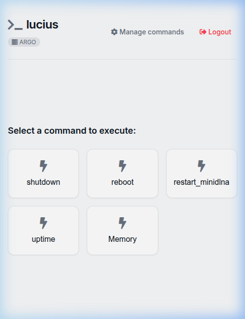
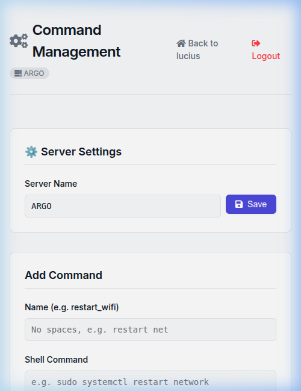

<div align="center">

# ⚡ Lucius

### Your shell commands, one tap away.

**Lucius is a self-hosted web dashboard that lets you run your custom shell commands on any Linux machine — directly from your phone or browser. No SSH. No terminal. Just tap.**

[](https://opensource.org/licenses/MIT)


</div>

---

<table>
  <tr>
    <td align="center"><b>📱 Dashboard</b></td>
    <td align="center"><b>⚙️ Command Management</b></td>
  </tr>
  <tr>
    <td></td>
    <td></td>
  </tr>
</table>

---

## 🤔 Why Lucius?

You have a Raspberry Pi, a home server, or a VPS. You need to restart a service, check memory, or run a script. Currently you:

1. Open a terminal
2. SSH into the machine
3. Type the command

**With Lucius**, you open your phone, tap a button, done. It's designed to be the *simplest possible tool* for this job — nothing more, nothing less.

> **Not a replacement for Cockpit or Webmin.** Those are powerful full-panel tools. Lucius is for the *20% of tasks you do 80% of the time*, with a UI that feels native on mobile.

---

## ✨ Features

- 📱 **Mobile-First** — thumb-friendly grid layout, works great on any phone
- ⚡ **One-tap execution** — no typing, no SSH, no friction
- 🛡️ **Secure by design** — PIN auth + strict command whitelist (no shell injection possible)
- ⚙️ **Web-based management** — add, edit, delete commands from the UI, no config files to edit
- 🖥️ **Custom server name** — label each machine so you always know what you're controlling
- 🌙 **Dark mode** — automatic, follows your system preference
- 🌍 **Universal Linux support** — Ubuntu, Debian, Raspberry Pi OS, Fedora, Arch and any `systemd`-based distro
- 🔄 **Zero-downtime updates** — built-in `update.sh` preserves all your configuration

---

## 🚀 Installation

Run this single command on your Linux machine:

```bash
curl -sSL https://raw.githubusercontent.com/ar3ac/lucius/main/install.sh | sudo bash
```

The script will automatically:
1. Install Python and system dependencies
2. Clone Lucius into `/opt/lucius`
3. Ask you to set a secure access PIN
4. Register and start `lucius.service` via systemd (runs on boot)

Then open **`http://<your-server-ip>:8000`** from any device on your network.

---

## 💡 Use Cases

| What you want to do | Example command |
|---|---|
| Reboot the server | `sudo reboot` |
| Restart a service | `sudo systemctl restart nginx` |
| Check available memory | `free -h` |
| See system uptime | `uptime -p` |
| Pull latest code | `cd /var/www/myapp && git pull` |
| Clear system cache | `sudo sync && sudo sysctl -w vm.drop_caches=3` |

---

## 🔄 Updating

```bash
sudo /opt/lucius/update.sh
```

Automatically stops the service, pulls the latest version, updates dependencies, and restores your commands and settings.

## 🗑️ Uninstalling

```bash
sudo /opt/lucius/uninstall.sh
```

Cleanly removes the service, files, and all traces. Zero leftovers.

---

## 🔒 Security

Lucius is designed for **trusted LAN use**. It is **not** recommended to expose it directly to the public internet without additional protection.

- Access is protected by a PIN stored in the `.env` file
- The backend executes **only** commands explicitly saved in the whitelist — arbitrary shell injection is impossible by design

**Using `sudo` commands?** Add a `NOPASSWD` rule in `/etc/sudoers` for the specific commands you need, otherwise Lucius will timeout waiting for a password prompt:

```
your_user ALL=(ALL) NOPASSWD: /bin/systemctl restart nginx
```

**Want HTTPS?** Put Lucius behind a reverse proxy like [Nginx](https://nginx.org/) or [Caddy](https://caddyserver.com/) with a Let's Encrypt certificate for secure remote access.

---

## 📁 Project Structure

```
lucius/
├── main.py                 # FastAPI backend — routing and command execution
├── templates/              # Jinja2 HTML templates
│   ├── base.html
│   ├── index.html          # Dashboard
│   ├── manage.html         # Command management UI
│   └── login.html
├── static/
│   └── style.css           # Full design system (light + dark mode)
├── lucius.service          # systemd service template
├── install.sh              # Universal installer
├── update.sh               # Safe updater (preserves your config)
├── uninstall.sh            # Clean uninstaller
└── requirements.txt        # Minimal Python dependencies
```

---

## 🤝 Contributing

Pull requests are welcome. For major changes, please open an issue first to discuss what you'd like to change.

---

<div align="center">
Made with ☕ and Python · <a href="https://github.com/ar3ac/lucius">github.com/ar3ac/lucius</a>
</div>
