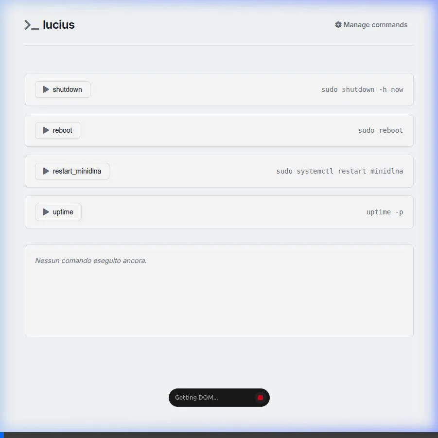

# ⚡ Lucius

**An elegant Python web tool to launch custom shell commands on any Linux machine or server from any device.**

<details>
  <summary>🎥 <b>Click here to view the Demo Video</b></summary>
  <br>
  
</details>

## 🛠️ Tech Stack


## ✨ Features
* 📱 **Mobile-First Elegant Design**: A responsive, clean web interface inspired by modern tech designs.
* 🚀 **Quick Actions**: Execute bash scripts, restart services, clear caches, all with a single tap. No SSH terminal required.
* 🛡️ **Security**: PIN authentication (`.env`) and strict Command Whitelisting (no shell injection possible).
* ⚙️ **Dynamic Management**: Add, edit, or delete your custom commands directly from the web interface.
* 🌍 **Universal**: Works natively on Ubuntu, Debian, Raspberry Pi OS, Fedora, and any systemd-based Linux distribution.
* 🔄 **Built-in Lifecycle**: Includes automated installation, uninstallation, and update scripts.

## 🚀 Installation

The easiest way to install and start Lucius as a background service on your server is via the automated installation script. 
Run this command on your target machine:

```bash
curl -sSL https://raw.githubusercontent.com/ar3ac/lucius/main/install.sh | sudo bash
```

The script will automatically:
1. Install Python and necessary dependencies.
2. Clone Lucius into `/opt/lucius`.
3. Prompt you to create a secure `LUCIUS_PIN`.
4. Configure and start the `lucius.service` via systemd.

Once installed, simply open `http://<your-server-ip>:8000` in your browser.

## 🔄 How to Update
To securely update Lucius to the latest version, run the automated update script on your server:
```bash
sudo /opt/lucius/update.sh
```
This will automatically stop the service, pull the latest changes, update dependencies, and restart the service without losing your configuration.

## 🗑️ How to Uninstall
If you want to completely remove Lucius from your system, run the automated uninstaller:
```bash
sudo /opt/lucius/uninstall.sh
```
This will cleanly stop and disable the systemd service, remove the service file, and delete the `/opt/lucius` folder leaving zero traces.

## 📁 Folder Structure
* `main.py` - Core FastAPI logic and routing.
* `commands.json` - Your local "database" of saved commands.
* `lucius.service` - Systemd template to run the app in the background.
* `install.sh` - Universal Linux automated installer.
* `templates/` - HTML files (Jinja2) for rendering interfaces.
* `static/` - CSS file for styling.

## 🔒 Security and Best Practices
Lucius is designed to run in your **Local Area Network (LAN)**. 
* Access is protected by the `LUCIUS_PIN` defined in the `.env` file.
* The backend **only** accepts and executes commands defined and saved in the management interface (Whitelist). A user cannot pass and execute arbitrary unregistered commands.

⚠️ **Important Note on `sudo` Commands**: 
If you add commands that require root privileges (e.g., `sudo systemctl restart nginx`), the tool will hang if the system prompts for a password. You **must** configure your `/etc/sudoers` file to allow the user running Lucius to execute those specific commands without a password prompt (`NOPASSWD`).
