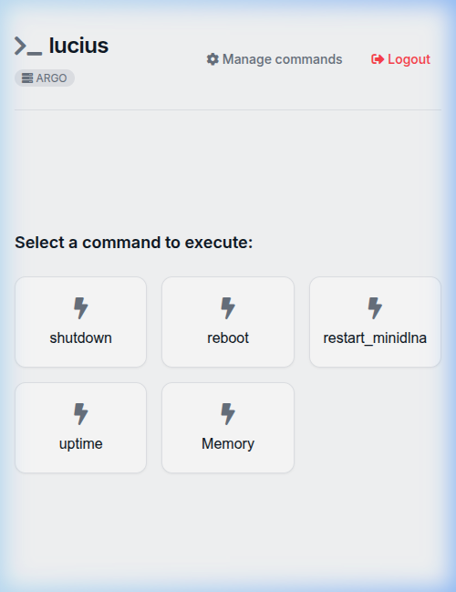
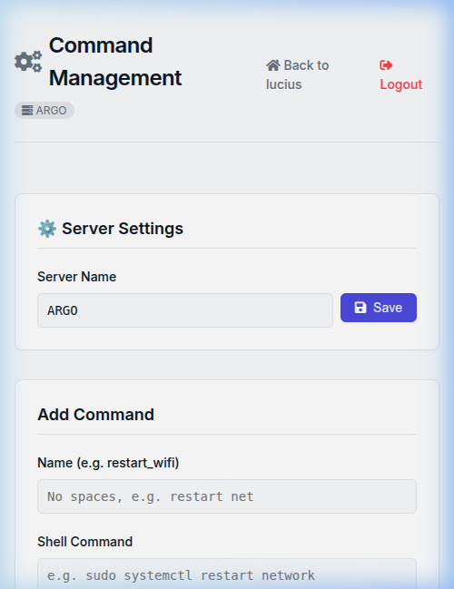

<div align="center">

# ⚡ Lucius

### Your shell commands, one tap away.

**Lucius is a self-hosted web dashboard that lets you run your custom shell commands on any Linux machine — directly from your phone or browser. No SSH. No terminal. Just tap.**

[](https://opensource.org/licenses/MIT)


</div>

---

<table>
  <tr>
    <td align="center"><b>📱 Dashboard</b></td>
    <td align="center"><b>⚙️ Command Management</b></td>
  </tr>
  <tr>
    <td></td>
    <td></td>
  </tr>
</table>

---

## 🤔 Why Lucius?

You have a Raspberry Pi, a home server, or a VPS. You need to restart a service, check memory, or run a script. Currently you:

1. Open a terminal
2. SSH into the machine
3. Type the command

**With Lucius**, you open your phone, tap a button, done. It's designed to be the _simplest possible tool_ for this job — nothing more, nothing less.

> **Not a replacement for Cockpit or Webmin.** Those are powerful full-panel tools. Lucius is for the _20% of tasks you do 80% of the time_, with a UI that feels native on mobile.

---

## ✨ Features

- 📱 **Mobile-First & High Accessibility** — huge thumb-friendly action cards with instant visual recognition, effortless to tap even without glasses
- 📲 **PWA Ready** — installable directly on your phone's home screen as a native-like app (no browser bars) with offline caching
- ⚡ **Real-time execution (WebSockets)** — stream command output line-by-line as it happens, exactly like a real terminal
- 📖 **Execution History & Logs** — keep track of who ran what and when, with a dedicated `/logs` page showing the last 50 commands and their output
- 🛡️ **Secure by design** — PIN auth + strict command whitelist (no shell injection possible)
- ⚙️ **Web-based management** — add, edit, delete, and reorder commands from the UI, no config files to edit
- ↕️ **Custom command ordering** — reorder commands via drag-and-drop or one-tap Up/Down arrows to prioritize your most frequent actions
- 🖥️ **Custom server name** — label each machine so you always know what you're controlling
- 🎨 **Dark / Light mode** — toggle manually from the Manage page or let it follow your system preference
- 🌍 **Universal Linux support** — Ubuntu, Debian, Raspberry Pi OS, Fedora, Arch and any `systemd`-based distro
- 🔄 **Zero-downtime updates** — built-in `update.sh` preserves all your configuration

---

## 🚀 Installation

Run this single command on your Linux machine:

```bash
curl -sSL https://raw.githubusercontent.com/ar3ac/lucius/main/install.sh | sudo bash
```

The script will automatically:

1. Install Python and system dependencies
2. Clone Lucius into `/opt/lucius`
3. Ask you to set a secure access PIN
4. Register and start `lucius.service` via systemd (runs on boot)

Then open **`http://<your-server-ip>:8000`** from any device on your network.

---

## 📲 How to Install on your Phone (PWA)

Since Lucius is often used on local networks without HTTPS, browsers might hide the automatic "Install App" prompt. Here is how you can still add it to your home screen with the custom logo:

**🍏 iOS (iPhone / iPad)**

1. Open **Safari** and navigate to your Lucius dashboard (e.g., `http://192.168.1.84:8000`).
2. Tap the **Share** button (the square with an upward arrow at the bottom).
3. Scroll down and tap **"Add to Home Screen"**.
4. Tap **Add**. Lucius will now behave like a native app!

**🤖 Android (Chrome)**

1. Open **Chrome** and navigate to your Lucius dashboard.
2. Tap the **3-dot menu** in the top right corner.
3. Select **"Add to Home screen"**.
4. _(Optional for Power Users)_: To unlock the full offline caching without HTTPS, type `chrome://flags` in the address bar, search for **"Insecure origins treated as secure"**, enable it, and enter your server's URL. Relaunch Chrome and the native Install prompt will appear.

---

## 💡 Use Cases

| What you want to do    | Example command                                |
| ---------------------- | ---------------------------------------------- |
| Reboot the server      | `sudo reboot`                                  |
| Restart a service      | `sudo systemctl restart nginx`                 |
| Check available memory | `free -h`                                      |
| See system uptime      | `uptime -p`                                    |
| Pull latest code       | `cd /var/www/myapp && git pull`                |
| Clear system cache     | `sudo sync && sudo sysctl -w vm.drop_caches=3` |
| Suspend remote machine | `ssh user@desktop systemctl suspend`           |

---

## 🔄 Updating

```bash
sudo /opt/lucius/update.sh
```

Automatically stops the service, pulls the latest version, updates dependencies, and restores your commands and settings.

## 🗑️ Uninstalling

```bash
sudo /opt/lucius/uninstall.sh
```

Cleanly removes the service, files, and all traces. Zero leftovers.

---

## 🔒 Security

Lucius is designed for **trusted LAN use**. It is **not** recommended to expose it directly to the public internet without additional protection.

- Access is protected by a PIN stored in the `.env` file (must be located in the project root folder)
- The backend executes **only** commands explicitly saved in the whitelist — arbitrary shell injection is impossible by design
- **Directory Permissions**: Lucius needs write access to its folder to save `commands.json` and `settings.json`. If you install manually, ensure the user running the service owns the project folder: `sudo chown -R $USER:$USER /opt/lucius`.

**Using `sudo` commands?** Add a `NOPASSWD` rule in `/etc/sudoers` for the specific commands you need, otherwise Lucius will timeout waiting for a password prompt:

```
your_user ALL=(ALL) NOPASSWD: /bin/systemctl restart nginx
```

**Want HTTPS?** Put Lucius behind a reverse proxy like [Nginx](https://nginx.org/) or [Caddy](https://caddyserver.com/) with a Let's Encrypt certificate for secure remote access.

---

## 📁 Project Structure

```
lucius/
├── main.py                 # FastAPI backend — routing and command execution
├── templates/              # Jinja2 HTML templates
│   ├── base.html
│   ├── index.html          # Dashboard
│   ├── manage.html         # Command management UI
│   └── login.html
├── static/
│   └── style.css           # Full design system (light + dark mode)
├── lucius.service          # systemd service template
├── install.sh              # Universal installer
├── update.sh               # Safe updater (preserves your config)
├── uninstall.sh            # Clean uninstaller
└── requirements.txt        # Minimal Python dependencies
```

---

## ☕ Support

If you find Lucius useful and want to support its development, feel free to buy me a coffee!

<a href="https://www.buymeacoffee.com/ar3ac" target="_blank"></a>

---

## 🤝 Contributing

Pull requests are welcome. For major changes, please open an issue first to discuss what you'd like to change.

---

## 🙏 Credits & Acknowledgments

Lucius is built on the shoulders of these fantastic open-source projects:
- **[FastAPI](https://fastapi.tiangolo.com/) & [Uvicorn](https://www.uvicorn.org/)** for the blazingly fast backend
- **[Jinja2](https://jinja.palletsprojects.com/)** for the rock-solid HTML templating
- **[FontAwesome](https://fontawesome.com/)** for the beautiful icons
- **[Inter Font](https://fonts.google.com/specimen/Inter)** by Google Fonts

---

<div align="center">
Made with ☕ and Python by <strong>Luca Marrazzo</strong> (<a href="https://github.com/ar3ac">@ar3ac</a>)
</div>
